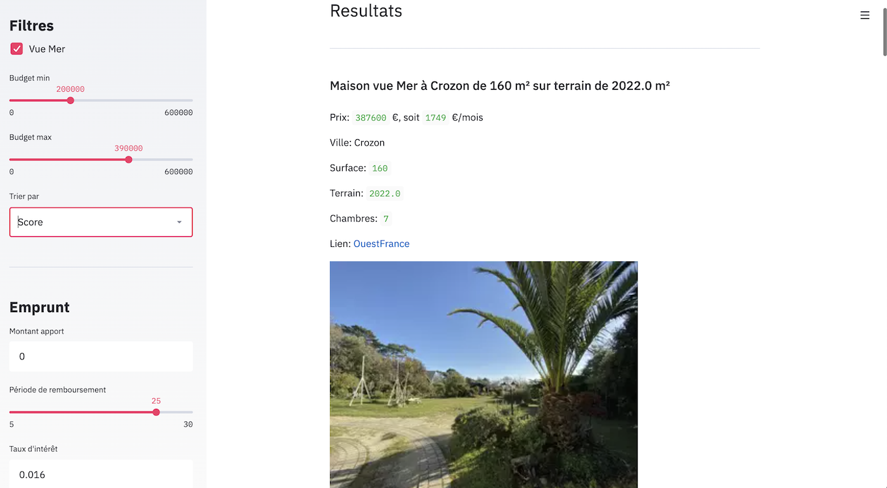

# AutoHome 

This small application was something that I used when my girlfriend and I were looking for a house to buy. It basically:
- scraps 5 real-estate agencies in the North-West part of France
- gathers the results in a single dataframe
- displays and sorts the results on a Streamlit web application



It mainly relies on:
- BeautifulSoup
- Streamlit

To run it, simply use:

```
pip install -r requirements.txt
```

And launch the app via:

```
streamlit run app.py
```

## Features

The application:
- shows you details and pictures on houses from OuestFrance Immo and other real-estate agencies
- has a filter on sea view
- allows you to select a minimum and maximum budget
- allows you to sort by date, price, self-determined score...
- allows you to specify the amount of money you need to borrow, the interest rate, and computes your monthly payments
- re-directs you to the source link with a simple click

Cool things:
- you can click on the "Actualiser" button, and it will re-scrap the whole set of websites (± 1mn)
- otherwise, results are stored in a dataframe, which makes the navigation way faster

